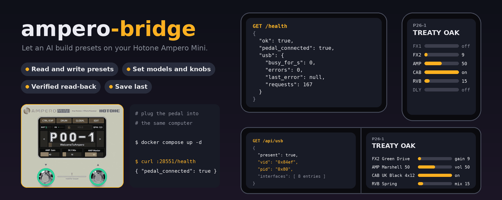

# ampero-bridge

A REST API of about a dozen endpoints, in a Docker container, that lets an AI agent, an LLM or any script
build presets on a Hotone Ampero Mini guitar effects pedal. The pedal plugs into a
computer over USB. This service runs on that computer and turns plain HTTP calls
into the USB MIDI messages the Hotone editor would send: pick a patch, switch
blocks on and off, choose amp, cab and effect models, set parameters, read a
preset back, and save it.

Hotone's own editor is point and click. This gives an AI the same hands, a preset
manager you can script.

## Quickstart

    git clone https://github.com/dhrandy/ampero-bridge && cd ampero-bridge
    cp .env.example .env        # then put a long random string in API_KEY
    docker compose up -d --build
    export API_KEY=$(grep ^API_KEY= .env | cut -d= -f2)
    curl -H "X-Api-Key: $API_KEY" http://localhost:28551/api/health

`pedal_connected: true` means it is talking to your Ampero Mini. The full setup,
with the compose file, is under [Run it](#run-it).

**Contents**

* [Quickstart](#quickstart)
* [Beta](#beta)
* [What it is for](#what-it-is-for)
* [What you need](#what-you-need)
* [Run it](#run-it)
  * [Dockhand](#dockhand)
  * [Putting it on the internet: reverse proxy (Synology example)](#putting-it-on-the-internet-reverse-proxy-synology-example)
* [Using it with your AI agent](#using-it-with-your-ai-agent)
  * [Reading what is in a patch](#reading-what-is-in-a-patch)
  * [Finding a patch by name](#finding-a-patch-by-name)
  * [Models](#models)
  * [Example calls](#example-calls)
* [API](#api)
* [Safety](#safety)
* [Settings](#settings)
* [Develop](#develop)
* [Docs](#docs)

## Beta

This is a beta. It works on the one Ampero Mini it was built and tested on,
running firmware V2.2, but the USB protocol is partly reverse-engineered, so some
things are not proven yet (`docs/models.md` and `docs/knobs.md` say which). It has
only been tried on a single pedal and firmware, so your unit may behave
differently. The model lists and codes in `docs/` are a snapshot of firmware V2.2; a firmware update can add or rename models, so check them again if yours differs. Back up a patch
before you let anything change it, and save last. Bug reports, and notes on what
works or breaks on your Mini, are welcome as GitHub issues.

## What it is for

You tell an agent "make me a clean Fender-ish patch with a bit of spring reverb",
and it does the work on the real pedal: it reads what is there, changes the
blocks, picks models, sets the knobs, checks its work by reading the patch back,
and saves. It can also back up a patch before touching it.

It has only been tested on the Ampero Mini, and that is the only pedal it
supports. The Mini's USB-MIDI protocol differs from the Ampero II Stage, so
nothing here is shared with those.

## What you need

* An Ampero Mini plugged into the same computer that runs the bridge. The bridge
  talks to the pedal over that computer's USB bus, so it cannot reach a pedal on
  another machine. Linux is the only system it has been run on (inside Docker, on
  one machine).
* Docker with Compose, or Python 3.12 with libusb to run it directly
  (`pip install -r requirements.txt`, then `python server.py` with `API_KEY` set; not
  tried yet). macOS and Windows are untested: Docker Desktop cannot pass USB devices
  through by itself, and a direct run would need libusb access to a device the OS
  normally claims.
* About ten minutes.

## Run it

The whole setup is two files next to each other: `docker-compose.yml` and `.env`.
The repo has both (`.env.example` is the template for `.env`).

`docker-compose.yml` (builds the image straight from this repo):

Show docker-compose.yml

    services:
      ampero-bridge:
        # Builds straight from git.
        build: https://github.com/dhrandy/ampero-bridge.git#main
        # API_KEY comes from the .env file next to this one (or from the environment
        # settings of whatever deploys the stack). Never put the raw key in this file.
        environment:
          - PORT=8080
          - API_KEY=${API_KEY}
          # Optional overrides, only after checking GET /api/usb on the real pedal:
          # - AMPERO_USB_INTERFACE=3
          # - AMPERO_USB_MODE=midi   (midi = USB-MIDI 4-byte packets, raw = bytes as-is)
          # - AMPERO_USB_TIMEOUT_MS=1000
          # - AMPERO_ALLOW_UNPROVEN_MODELS=1   (let /api/model send model codes not yet proven)
        ports:
          # Published on every host interface so a reverse proxy on another machine
          # can reach it. This port speaks plain HTTP, so limit it with a firewall
          # rule to the proxy's address if you can.
          - "28551:8080"
        # libusb talks to the pedal directly. No /dev/snd: nothing in this container
        # may open an ALSA MIDI port, that is what wedged the host kernel.
        device_cgroup_rules:
          - "c 189:* rmw"
        volumes:
          # USB bus nodes, bind-mounted so replugging the pedal is seen live.
          - /dev/bus/usb:/dev/bus/usb
          # Names of the patches the bridge has seen are kept here, so they survive
          # rebuilds. Set DATA_DIR in .env to put the folder somewhere else.
          - ${DATA_DIR:-./data}:/data
        # The only thing the bridge writes is that data folder, so lock the rest down.
        cap_drop:
          - ALL
        security_opt:
          - no-new-privileges:true
        read_only: true
        tmpfs:
          - /tmp:size=16m
        mem_limit: 128m
        pids_limit: 100
        # The bridge exits itself (code 70) if a USB request outlives its deadline,
        # so this brings it back clean. See docs/usb-lockups.md.
        restart: unless-stopped
        # Tiny init so signals reach the bridge and no zombies pile up.
        init: true
        # Docker only marks a wedged container unhealthy. The restart policy above
        # needs the process to exit, which the in-process watchdog does. /health is
        # the open liveness check and only returns {"ok": true}; pedal details are
        # behind the key at /api/health.
        healthcheck:
          test: ["CMD", "python", "-c", "import urllib.request as u; u.urlopen('http://127.0.0.1:8080/health', timeout=4)"]
          interval: 30s
          timeout: 6s
          retries: 3
          start_period: 10s
        logging:
          driver: json-file
          options:
            max-size: "5m"
            max-file: "3"
        # The bridge exits immediately on SIGTERM, there is nothing to flush.
        stop_grace_period: 5s

`.env` (copy `.env.example` and fill it in):

    API_KEY=paste-a-long-random-string-here

Make the key with `openssl rand -hex 32`. Anyone who has it can change your pedal,
so the service will not start with a key under 24 characters or with the
placeholder. The compose file reads it as a plain `${API_KEY}`, so the key never
goes in the compose file.

1. Create the two files above in one folder.
2. Start it:

        docker compose up -d --build

3. Check it. `/health` needs no key and only says the service is up. The
   details are behind the key:

        curl http://localhost:28551/health
        curl -H "X-Api-Key: $API_KEY" http://localhost:28551/api/health

   `pedal_connected` should be `true`. The compose file maps host port 28551 to
   the container's 8080. Change the left number if you want another port.

The container gets `/dev/bus/usb` and a cgroup rule for USB devices (major 189).
It does not get `/dev/snd`, on purpose. The pedal only has to be plugged in when
you want to change something, and replugging it is fine. Any USB port works:
the bridge finds the pedal by its USB vendor and product ID (`84ef:0080`), not by
port, so moving it to another port is fine.

### Dockhand

Create a stack from `docker-compose.yml`. Set `API_KEY` in the stack's
**Environment** tab instead of a `.env` file. Dockhand fills in the `${API_KEY}`
when it deploys. Do not paste the key into the compose file.

### Putting it on the internet: reverse proxy (Synology example)

The bridge speaks plain HTTP, so put TLS in front of it with a reverse proxy.

Show both layouts and the Synology steps

**Layout 1: one port, 443, through the proxy.** This is the tested example. Your
router forwards only port 443 to the NAS. The proxy is the only way in from
outside, and the bridge's own port (28551) is never forwarded, so it is only
reachable from your home network. Every `/api` call still needs the key: a wrong
or missing key gets a 401 and changes nothing.

On a Synology NAS: Control Panel, Login Portal, Advanced, Reverse Proxy, Create.
Source: HTTPS, your hostname, port 443. Destination: HTTP, the IP of the computer
running the container, port 28551. Add a certificate for the hostname under
Security, Certificate. Keep the key long and random.

**Layout 2: you expose more than that.** If you forward other ports, run the
bridge somewhere other devices on your network can reach, or do not trust
everything on your LAN, also limit port 28551 on the container host to the
proxy's address. This is recommended there. Docker's published ports skip the
usual `ufw` rules, so the rule goes in the `DOCKER-USER` chain. If the proxy runs
on the same computer as the container, you can instead publish the port on
loopback only: change the compose line to `"127.0.0.1:28551:8080"`.

## Using it with your AI agent

Give the agent three things: the bridge's address, the `X-Api-Key` value, and
this file (or `docs/models.md`). Then ask in plain words. It can do any of these:

* Build a preset from scratch: pick the blocks and models, set the knobs, name it, save it.
* Tweak a preset that already exists: read it, change a few parameters, save.
* Swap a model in one block (a different drive, amp or reverb) and keep the rest.
* Turn blocks on or off, or clean up a preset so it only uses what it needs.
* Check a patch: read it back and say what is in it, block by block (see "Reading what is in a patch" below).
* Back up a patch before changing it, and put it back if you do not like the result.

A prompt that works for any of those:

> You can control my Hotone Ampero Mini through a web API at http://SERVER:28551.
> Send the key in the `X-Api-Key` header. Read README.md in the ampero-bridge repo
> first. Here is what I want: [for example "a bright clean tone with light spring
> reverb in P26-1", or "on the patch that is selected now, lower the drive and
> swap the delay for a slapback"]. Read the patch before you change anything and
> keep it as a backup. Make every change first, read it back to check, and save
> last. To see what is in a patch, decode `record_hex` from `GET /api/patch/current`
> using "Reading what is in a patch" in README.md and docs/protocol.md; the server
> only decodes the name. To find a patch by name, check GET /api/patches/known
> first: it is free and does not touch the pedal. For models, call GET /api/models
> (every model with its code, what it is based on, and short notes; add `?block=AMP` or
> `?q=text` to narrow it). If that is not available, fetch
> https://dhrandy.github.io/ampero-bridge/models.json, or read docs/models.md. Use
> docs/knobs.md for which knob is which. Never guess a model code or a knob: if a code
> is not marked pedal-proven, say so and read the record to find out.

The agent should follow this order. It is the order that keeps the pedal safe:

1. `GET /api/health`. Make sure `pedal_connected` is true. Then `GET /api/patches/known` to see which patch names the bridge already knows before reading the pedal.
2. `POST /api/patch/select` the slot you want to edit.
3. `GET /api/patch/current`. Keep the `record_hex` as a restore point.
4. `POST /api/block` to turn blocks on or off. Do not assume everything is on:
   turn off what the patch does not use.
5. `POST /api/model` to pick the model for each block, then `POST /api/param` for
   each knob. A model change resets that block's knobs to defaults, so set the
   model first.
6. `GET /api/patch/current` again and compare. This is the only proof a write
   worked, because the pedal never answers a write.
7. `POST /api/patch/save`, last, with the confirm text.

### Reading what is in a patch

`GET /api/patch/current` returns `index`, `label`, `name` and `record_hex`. The
name and slot come ready to use. The effect chain (which blocks are on, which
model each one runs, every knob value) is in `record_hex`, and the server does not
unpack it for you: the agent does that from the record layout in
`docs/protocol.md` ("Record layout"). The only decoding code in the repo is
`decode_patch()` in `ampero_mini.py`, which joins the pedal's reply into the
460-byte record and reads the index and name. Reading the blocks is a few lines:

Show a Python example that decodes every block

    import json, urllib.request
    req = urllib.request.Request("http://SERVER:28551/api/patch/current",
                                 headers={"X-Api-Key": "your-key"})
    rec = bytes.fromhex(json.load(urllib.request.urlopen(req))["record_hex"])
    BLOCKS = {"fx1": 95, "fx2": 128, "amp": 161, "nr": 194, "cab": 227,
              "eq": 260, "fx3": 293, "dly": 326, "rvb": 359}
    for name, at in BLOCKS.items():
        on = rec[at] == 1
        model = rec[at + 1] * 128 + rec[at + 2]
        params = [int.from_bytes(rec[at + 4 + 2 * i : at + 6 + 2 * i], "little")
                  for i in range(5)]
        print(name, "on" if on else "off", "model", model, params)

Each block is 33 bytes. The state byte is 1 for on and 0 for off. The model is a
code, so look it up in `docs/models.md`. Knob values are two bytes each, low byte
first, and the first five cover most models. Which knob is which for a model is in
`docs/knobs.md`, with how sure each entry is. Reading never changes
the pedal; it also needs no select first if the patch you want is the one on the
screen.

### Finding a patch by name

Reading the pedal is slow, so the bridge remembers. Every time it reads a patch
(`GET /api/patch/current`) or saves one, it notes the slot, label and name in a
small file in the data folder. `GET /api/patches/known` returns that list at once
and does not touch the pedal:

    curl -H "X-Api-Key: $API_KEY" http://localhost:28551/api/patches/known

    {"count": 2, "persistent": true, "patches": [
      {"index": 76, "label": "P26-2", "name": "EXAMPLE ONE", "seen": "2026-10-04T16:00:00+00:00", "source": "read"},
      {"index": 78, "label": "P27-1", "name": "EXAMPLE TWO", "seen": "2026-10-04T16:05:00+00:00", "source": "read"}]}

It only knows patches that were read or saved through the bridge, and a patch you
rename on the pedal itself stays stale until it is read again. So treat it as a
fast first look: if the patch you want is there, select that slot and read it to
confirm. If it is not there, the bridge has not seen it yet, not that it does not
exist. `persistent: false` means the data folder cannot be written and the list
will be lost on restart.

The data folder is `./data` next to `docker-compose.yml`, mounted at `/data` in
the container (set `DATA_DIR` in `.env`, or in Dockhand's Environment tab, for
another host folder). It must be writable by root, because the container drops its
other privileges. After pulling this version, rebuild the stack once so the mount
is picked up.

### Models

A model is picked by a number, not a name. `docs/models.md` lists the numbers that
have been checked on a real pedal. The numbers are not simply the screen number
minus one for every block (the effects list jumps in places), so an agent should
not guess one. The safe way to learn a new model: pick it on the pedal, read the
patch, and take the number from the record. Hotone's manual says
what real gear each model is based on.

### Example calls

    KEY=your-key
    H="X-Api-Key: $KEY"
    curl -H "$H" http://localhost:28551/api/patch/current
    curl -H "$H" -X POST -d '{"index": 75}' http://localhost:28551/api/patch/select
    curl -H "$H" -X POST -d '{"block": "rvb", "on": true}' http://localhost:28551/api/block
    curl -H "$H" -X POST -d '{"slot": "rvb", "code": 4}' http://localhost:28551/api/model
    curl -H "$H" -X POST -d '{"slot": "rvb", "model_code": 4, "param": 0, "value": 15}' http://localhost:28551/api/param
    curl -H "$H" -X POST -d '{"index": 75, "name": "MY PATCH", "confirm": "SAVE P26-1"}' http://localhost:28551/api/patch/save

Patch `index` is the Program Change number, counting from 0. Index 75 is the
pedal's P26-1 (three patches per bank).

### Catching a state that went by

A client read takes several seconds, so a state that comes and goes in between (a
knob turned and turned back, a model flipped through) is easy to miss. The bridge
therefore reads the pedal's current patch on its own every couple of seconds and
keeps the last ten minutes in memory. A new entry is added only when the record
changed. Each one has the time it first and last appeared, the patch `index`, `label`
and `name`, `record_hex`, and `changed_bytes`, the record offsets that differ from the
entry before it:

    curl -H "X-Api-Key: $API_KEY" "http://localhost:28551/api/history?since=1759593600&hex=0"

It only reads, like `/api/patch/current`. The cost is that each background read
uses the USB link for about a second and a half, so a request from a client can wait
up to about two seconds for its turn. Polling pauses while the pedal is unplugged.

The poller eases off by itself so it does not crowd the pedal. Only one read is ever
open at a time, and the wait before the next one is never shorter than the last read
took. While the patch keeps changing (you are editing or stepping through models) the
wait doubles, then doubles again, up to `AMPERO_HISTORY_BUSY_MAX_S`, and goes back to
the base after two quiet reads. After a failed read, for example an incomplete patch
dump, it waits 4 times the base and doubles each time up to 30 seconds. The price is
that you catch fewer states while you step quickly: give each stop about ten seconds if
you want every one recorded. `/api/health` shows `current_poll_s` and `pace`
(`idle`, `busy` or `errors`).

The log lives in memory and starts empty after a restart. Set
`AMPERO_HISTORY_POLL_S=0` to switch it off. `/api/health` shows the history status.

## Model library

A searchable list of every Ampero Mini model on firmware V2.2 is at
https://dhrandy.github.io/ampero-bridge/ (beta). Use it to find a model fast, see the
code the pedal stores for it, and see what real-world gear it is based on. A tap on an
amp opens short notes on its tone and what it is known for. Codes that have been read
back from a real pedal are marked; every row in the library is now read from a real pedal
(firmware V2.2). Re-check a code after a firmware update.

The same data is in `site/models.json`, for tools and agents: block, screen, code, name,
what it is based on, how well the code is verified, and short notes. The bridge serves
that file at `GET /api/models` (needs the API key, reads no pedal), so an agent can get it
from one server without going online. Without the bridge, fetch it from
https://dhrandy.github.io/ampero-bridge/models.json or the raw file at
https://raw.githubusercontent.com/dhrandy/ampero-bridge/main/site/models.json. An agent
building a preset can use it to pick models by name or by what they imitate, then send
only pedal-proven codes without a read-back. The page is not indexed by search engines.

## API

Send `X-Api-Key`. Only `/health` is open, and it only returns `{"ok": true}`.

| Call | Body | What it does |
| --- | --- | --- |
| `GET /health` | | `{"ok": true}`, no key needed. Used by the Docker healthcheck |
| `GET /api/health` | | `pedal_connected`, request counters, `usb_seen` (how many USB devices the service can see) |
| `GET /api/usb` | | interfaces and endpoints the pedal reports, plus every USB device the service sees. If this lists fewer devices than `lsusb` on the host, restart the container |
| `GET /api/patch/current` | | read the patch the pedal has selected: `index`, `label`, `name`, `record_hex` |
| `GET /api/patch/<index>` | | same, but 409 (with `current_index`, `current_name`) unless `<index>` is the selected patch. Select it first |
| `GET /api/patches/known` | | slot, label, name and when it was last seen, for every patch the bridge has read so far. Answers from memory, never touches the pedal |
| `GET /api/models` | | the model library: every model with block, screen, code, name, what it is based on, how well the code is verified, and short notes. Optional `?block=AMP` (one of fx1 fx2 amp nr cab eq fx3 dly rvb) and `?q=text` (matches name or based-on). Same data as `site/models.json`. Reads no pedal |
| `GET /api/history` | | the last few minutes of the pedal's edit buffer, one entry per change, with the byte offsets that changed. Optional `?since=<epoch seconds>` and `?hex=0` (leave out `record_hex`). Answers from memory, see "Catching a state that went by" |
| `POST /api/patch/select` | `{"index": 75}` | Program Change (0 based, 75 = P26-1) |
| `POST /api/block` | `{"block": "rvb", "on": true}` | block on/off (fx1 fx2 amp nr cab eq fx3 dly rvb) |
| `POST /api/midi/cc` | `{"cc": 22}` | send one Control Change on channel 1. Any CC 0 to 127 is accepted (optional `value`, 0-127, default 127). Proven on a real Mini so far: 22 bank down, 23 bank up, 24 patch down, 25 patch up (patch navigation, not model scrolling). Not for AI preset building |
| `POST /api/model` | `{"slot": "rvb", "code": 4}` | pick a model for a slot. Only codes listed in `docs/models.md` as proven or read from the pedal are accepted (see Settings) |
| `POST /api/param` | `{"slot": "rvb", "model_code": 4, "param": 0, "value": 15}` | set one parameter (0-127) |
| `POST /api/patch/save` | `{"index": 75, "name": "WADE", "confirm": "SAVE P26-1"}` | save to a slot; needs the exact confirm text |

Errors come back as `{"error", "kind"}`: 400 bad input, 401 key, 429 too many writes in line (see `Retry-After`), 503 pedal not
connected or busy, 504 pedal silent, 502 other USB error.

The record is 460 bytes: the name, then nine blocks (fx1, fx2, amp, nr, cab, eq,
fx3, dly, rvb) with their model and parameters. The layout is in `docs/protocol.md`.

## Safety

* **Save is always the last step.** A save stores whatever is in the pedal's edit
  buffer at that moment. Make every change, read it back, then save.
* A save needs the exact `confirm` text, so a stray call cannot overwrite a patch.
* `/api/model` only takes model numbers that were checked on a real pedal, because an unknown one can crash it. To try others, set `AMPERO_ALLOW_UNPROVEN_MODELS=1`.
* Keep `API_KEY` private and do not expose the port to the internet.

## Settings

Set these in `.env` (or Dockhand's Environment tab).

| Var | Default | |
| --- | --- | --- |
| `API_KEY` | required | the key clients send in `X-Api-Key` |
| `PORT` | 8080 | port inside the container |
| `DATA_DIR` | `./data` | host folder for the remembered patch names (compose setting, mounted at `/data`) |
| `AMPERO_MODELS_FILE` | bundled | path to a different `models.json` for `/api/models`; the image ships the one from `site/` |
| `AMPERO_HISTORY_POLL_S` | 2 | base seconds between the background reads that feed `/api/history`. `0` turns the history off. The wait grows on its own while the patch is changing or reads fail |
| `AMPERO_HISTORY_BUSY_MAX_S` | 10 | longest wait while the patch keeps changing |
| `AMPERO_HISTORY_WINDOW_S` | 600 | how many seconds of history to keep (also capped at 400 entries) |
| `AMPERO_WRITE_GAP_S` | 0.5 | least seconds between two writes to the pedal. Writes go out one at a time, in the order they came in |
| `AMPERO_WRITE_SAVE_GAP_S` | 3 | quiet time before a save and after it. A save waits this long after the last write, and the next write waits this long after the save |
| `AMPERO_WRITE_QUEUE_MAX` | 6 | writes allowed in line at once. More get `429` with a `Retry-After` header and nothing is sent. Reads, health and refused requests are never held up |
| `AMPERO_ALLOW_UNPROVEN_MODELS` | off | set to `1` to let `/api/model` send model codes not listed as proven |

More options (USB timeouts and so on) are listed in `docs/usb-lockups.md`.

## Develop

    pip install -r requirements.txt pytest
    python -m pytest

The tests are in `tests/` and use a fake pedal. Frames are checked byte for byte against the ones
captured from the editor and the pedal.

## Docs

* `docs/protocol.md`: the USB and SysEx protocol, record layout, order of a preset write
* `docs/models.md`: model numbers checked on a real pedal
* `site/`: the model library page and `site/models.json` (see Model library above)
* `docs/usb-lockups.md`: USB stability notes and the less common settings

Credits: this was built for the Ampero Mini from scratch. The Mini speaks a
different USB-MIDI protocol from the Ampero II Stage, so no frames or code are
shared. jpfaria's Stage work (github.com/jpfaria/hotone-ampero-2) was a useful
reference for what is possible on the Stage.

MIT licensed, see `LICENSE`.
